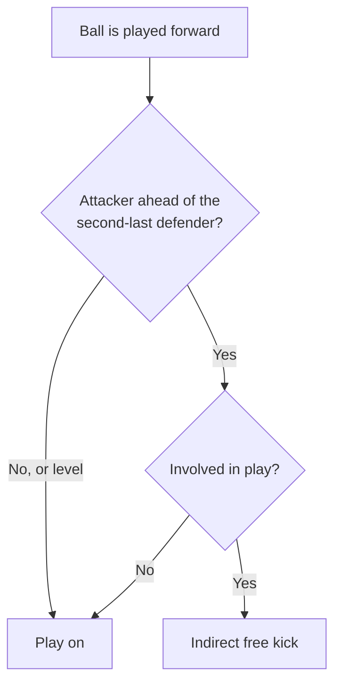

# 2. Close calls

Most decisions are easy and nobody remembers them. This chapter is about the other
kind: the ones decided by a few centimetres, or by what the referee judges a player
meant to do.

> 📖 **Definition — Offside**: being nearer the opponents' goal line than both the ball
> and the second-last defender, at the moment a team-mate plays the ball.

## The offside line

Offside is judged at a single instant — when the ball is played, not when it arrives.
Everything after that moment is irrelevant, however far the attacker runs. And being
offside is not an offence on its own: the player has to become involved.

> 📌 **Key concept**: the offside decision is about *where the attacker was*, not about
> where the ball ended up.

:::mermaid{title="How an offside decision is reached"}

:::

> ⚠️ **Pitfall**: level is onside. A player exactly in line with the second-last defender
> is not offside, which is why so many decisions look wrong from the stand.

> 🔍 **How it works**: the assistant referee watches the defenders rather than the ball,
> stepping along the line so the last one stays in view at the moment of the pass.

## A word you will hear

:term[advantage]{definition="Letting play go on when stopping it would punish the team that was fouled."}
is the referee's way of not rewarding a foul twice over. Tap the word to see what it
means, and tap it again to put it back.

It is the one decision that must be made in about a second, and it cannot be taken
back once the whistle has gone — which is why referees are taught to wait a beat
before blowing.

> 💡 **Tip**: watch the referee's arms after a foul goes unpunished. Both arms held
> forward and low means it was seen and waved on, not missed.

The seventeen laws are published in full, for free, by the body that keeps them, and
they are shorter than most people expect:
[the Laws of the Game](https://en.wikipedia.org/wiki/Laws_of_the_Game_(association_football)).

## When the whistle cannot be taken back

A referee may change a decision while play has not restarted — after a word from an
assistant, or on realising the ball went in off a hand. Once the game has restarted,
the decision stands, however wrong it turns out to be.

That rule sounds harsh, and it is the only thing keeping a match finishable. Without
it, every goal would stay provisional until somebody produced a better angle, and the
game would be decided in an argument rather than on the pitch.

Refereeing is, in the end, a job of deciding quickly and living with it. The laws are
written by people who understood that, which is why so many of them say *in the opinion
of the referee* — not as an escape, but as the point.

::checkpoint{id="ch2-done" label="I understand how the close calls are judged"}
