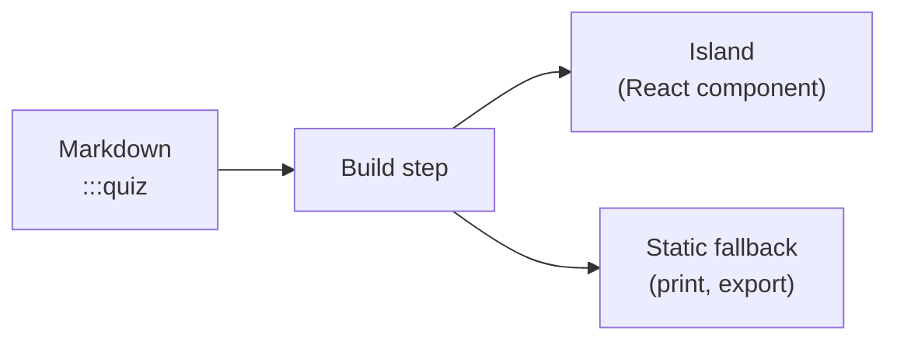

# 2. The interactivity toolkit

A smart ebook stays **plain Markdown**, but a small set of **directives** turns prose into
app-like activities. This chapter tours the toolkit and lets you try each piece.

> 📖 **Definition — Directive**: a `:::name{…}` block in Markdown that the build step turns
> into an interactive React component (an "island").

## Knowledge checks

Use a `:::quiz` block whenever you want the reader to self-test. Answers are scored and the
best result is saved locally.

:::quiz{id="ch2-directives"}

### Which of these is a valid interactive directive?

- [ ] `<Quiz />`
- [x] `:::quiz`
- [ ] `[quiz]`

> Explanation: Smart-ebook interactivity is declared with container/leaf directives like `:::quiz`.

### What must every stateful directive include? (select all)

- [x] A unique, stable `id`
- [x] A name from the taxonomy
- [ ] A server connection

:::

## Memory practice

`:::flashcard` blocks are great for definitions and spaced practice.

:::flashcard{id="ch2-directive-card"}
**Front:** What turns a directive into an interactive component?

**Back:** The build pipeline maps it to a registered React island.
:::

## Play to learn

`:::matching-pairs` mounts a match-the-pairs exercise. Here's the matching game again with
new pairs.

:::matching-pairs{id="ch2-match"}

```json
{
  "pairs": [
    ["directive", "authoring syntax"],
    ["island", "React component"],
    ["registry", "directive-to-component map"]
  ]
}
```

:::

## Diagrams

Not every island is an activity. `:::mermaid` draws a diagram from a fenced
[Mermaid](https://mermaid.js.org) block, so a picture stays **text** in the source — reviewable in a
diff, and translatable like any other prose.

It comes from the optional `mermaid` island pack, which this book declares in its `smartbook.json`.
Books that draw nothing never download it.

:::mermaid{title="How a directive becomes an island"}



:::

The diagram follows your light/dark setting — switch the theme in the header and it redraws.

## Marks inside a sentence

Every directive so far interrupts the prose to do its work — which is right for a quiz and
wrong for a definition. A `:term[…]` mark stays *in* the sentence: the word keeps its place,
and the explanation appears only if you ask for it.

A :term[palimpsest]{definition="A manuscript page scraped clean and written on again."} is a
good name for what an inline island does to a word: it writes something over it without
taking the page away. Tap it, and tap it again to put it back.

This is the same shape a novel needs for its characters, a travel guide for its places, and a
chess book for its moves. Strip the interactivity and you get the word the author wrote —
which is exactly how a printed glossary reads.

## Callouts, which are not islands at all

Not everything that stands out needs a component. Five kinds of aside are just **blockquotes
with an emoji**, and the reader styles them by kind.

Use the first for the one thing a reader should carry away:

> 📌 **Key concept**: a callout is a convention, not a feature — the emoji is the whole of it.

The second is for the reader who wants the mechanism underneath:

> 🔍 **How it works**: the renderer reads the leading emoji, tags the blockquote with its kind,
> and the stylesheet gives each kind its own colour.

The third earns its place by saving someone ten minutes:

> 💡 **Tip**: keep a callout to one idea. Two paragraphs of aside is a section wearing a hat.

The fourth states the mistake before the reader makes it:

> ⚠️ **Pitfall**: put the emoji first. A blockquote that opens any other way stays an ordinary
> quotation — which is what a quotation should be.

And the fifth pins a term down:

> 📖 **Definition — Callout**: an aside set apart from the prose, by convention rather than by
> markup.

That last point is the design. Because the marker is a character in the text rather than a
directive, a callout is greppable, reads correctly as plain Markdown in any editor, costs an
author nothing to learn — and survives an export where no stylesheet runs at all.

::checkpoint{id="ch2-done" label="I explored the interactivity toolkit"}
