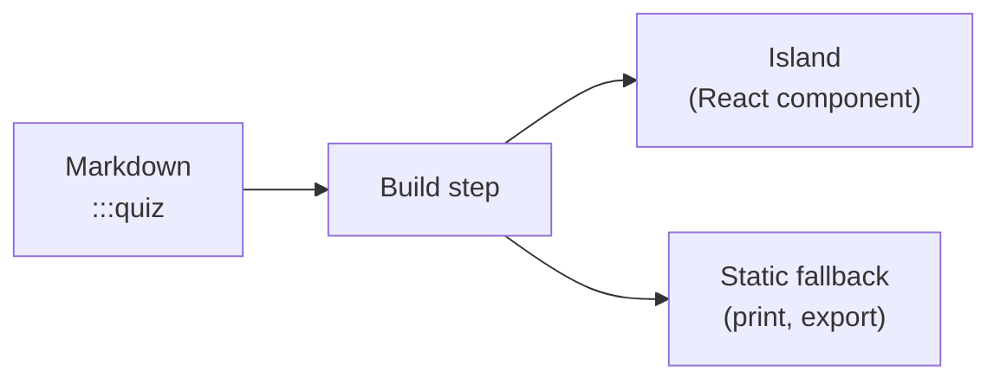

# 2. The interactivity toolkit

A smart ebook stays **plain Markdown**, but a small set of **directives** turns prose into
app-like activities. This chapter tours the toolkit and lets you try each piece.

> 📖 **Definition — Directive**: a `:::name{…}` block in Markdown that the build step turns
> into an interactive React component (an "island").

## Knowledge checks

Use a `:::quiz` block whenever you want the reader to self-test. Answers are scored and the
best result is saved locally.

:::quiz{id="ch2-directives"}
### Which of these is a valid interactive directive?

- [ ] `<Quiz />`
- [x] `:::quiz`
- [ ] `[quiz]`

> Explanation: Smart-ebook interactivity is declared with container/leaf directives like `:::quiz`.

### What must every stateful directive include? (select all)

- [x] A unique, stable `id`
- [x] A name from the taxonomy
- [ ] A server connection
:::

## Memory practice

`:::flashcard` blocks are great for definitions and spaced practice.

:::flashcard{id="ch2-directive-card"}
**Front:** What turns a directive into an interactive component?

**Back:** The build pipeline maps it to a registered React island.
:::

## Play to learn

`:::matching-pairs` mounts a match-the-pairs exercise. Here's the matching game again with
new pairs.

:::matching-pairs{id="ch2-match"}
```json
{
  "pairs": [
    ["directive", "authoring syntax"],
    ["island", "React component"],
    ["registry", "directive-to-component map"]
  ]
}
```
:::

## Diagrams

Not every island is an activity. `:::mermaid` draws a diagram from a fenced
[Mermaid](https://mermaid.js.org) block, so a picture stays **text** in the source — reviewable in a
diff, and translatable like any other prose.

It comes from the optional `mermaid` island pack, which this book declares in its `smartbook.json`.
Books that draw nothing never download it.

:::mermaid{title="How a directive becomes an island"}

:::

The diagram follows your light/dark setting — switch the theme in the header and it redraws.

::checkpoint{id="ch2-done" label="I explored the interactivity toolkit"}
