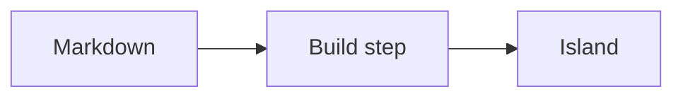

# Editorial Charter & Authoring Guide — Smart Ebooks

> How to write smart-ebook content consistently and how to embed interactivity with directives.
> Follow this for every chapter.
>
> **This file is also the constraint file for an authoring agent.** It is committed, and kept in step
> with `island-contract.json`, precisely so that a human and an agent are held to the same rules.
> If the two ever disagree, the contract is what the linter enforces — fix the charter.
>
> Last updated: 2026-08-30

---

## 1. Principles

- **Prose first, interactivity second.** A chapter must read well as plain Markdown even if every
  interactive island failed to load. Directives are *progressive enhancement*.
- **One vocabulary.** Use only the directives defined in §4. New interactivity means a new directive added
  here *and* a matching component in the app registry — never an ad-hoc block.
- **Local-only mindset.** Interactive elements must work with no network and no account. Never assume a
  server or fetch remote user data.
- **Accessible by default.** Everything usable by keyboard; every media element has a text alternative;
  color is never the only signal.

## 2. Tone & structure

- **Second person, direct** ("you"), pedagogical and precise; no hype.
- Reuse a **consistent chapter anatomy** where it fits the book (adapt from the certification books):
  intro → key concepts → how it works → practice (interactive) → recap.
- **Callouts** (blockquote, greppable) for emphasis:

  | Callout | Format |
  | --- | --- |
  | 📌 Key concept | `> 📌 **Key concept**: …` |
  | 🔍 How it works | `> 🔍 **How it works**: …` |
  | 💡 Tip | `> 💡 **Tip**: …` |
  | ⚠️ Pitfall | `> ⚠️ **Pitfall**: …` |
  | 📖 Definition | `> 📖 **Definition — Term**: …` |

## 3. Directive syntax (how interactivity is declared)

Interactivity uses [`remark-directive`](https://github.com/remarkjs/remark-directive) in two forms:

- **Container** (has a body of nested Markdown): three colons open and close.

  ````markdown
  :::name{key="value" key2="value2"}
  … nested Markdown / options …
  :::
  ````

- **Leaf** (a single line, no body): two colons.

  ```markdown
  ::name{key="value"}
  ```

Which form a directive takes is fixed per directive, not a choice — see §4.

**Rules:**

- `name` must be one of the registered directives in §4. Anything else **fails the build**
  (`directive-unknown`), it does not degrade to a placeholder.
- Names are **kebab-case** (`matching-pairs`, `chess-board`). The old concatenated spellings still
  render but the linter warns (`directive-alias`) — do not write new content with them.
- Attributes go in `{…}` as `key="value"` pairs, and are **validated against a declared schema**: an
  unknown value falls back to its default at runtime and is an error at lint time
  (`attribute-invalid`).
- `id` is **required on any stateful directive** (quiz, flashcard, checkpoint, media, games) so its
  progress can be persisted deterministically. Duplicates are an error (`id-duplicate`).
- `id` values are **stable and unique within the book** (kebab-case, prefixed by chapter, e.g.
  `ch1-tokens-quiz`). Changing an `id` resets that element's saved state.
- The **body** of a directive is normal Markdown, so the block still reads acceptably without the
  runtime.

## 4. Interactive directive taxonomy

> Legend: **State** = what the local persistence layer stores. **Pack** marks directives that are not
> built in: the book must declare the pack in `smartbook.json` before it may use them.
>
> This list must match [`island-contract.json`](island-contract.json), which is what the linter reads.

### `:::quiz` — Multiple-choice knowledge check (container)

Task-list syntax marks the answer(s); a blockquote after a question is its explanation.

````markdown
:::quiz{id="ch1-tokens-quiz"}
### What does a token represent?

- [ ] A full sentence
- [x] A chunk of text (sub-word)
- [ ] A single character

> Explanation: LLMs operate on tokens, typically sub-word units.
:::
````

- Multiple `###` questions allowed in one quiz block.
- `[x]` = correct option(s); more than one `[x]` = multi-select.
- **State:** best score, attempts, last answers, completed flag.

### `:::flashcard` — Flip card / spaced repetition (container)

````markdown
:::flashcard{id="ch1-token-def"}
**Front:** What is a token?

**Back:** A sub-word unit of text an LLM processes.
:::
````

- Group cards by placing several `:::flashcard` blocks together.
- **State:** review progress, stored locally.

### `::checkpoint` — Mark-as-complete / progress marker (leaf)

```markdown
::checkpoint{id="ch1-done" label="I finished the fundamentals"}
```

- Attributes: `label` (string).
- Renders a checkbox the reader ticks; feeds the global progress dashboard.
- **State:** complete flag.

### `::video` — Embedded video (leaf)

```markdown
::video{id="ch1-intro-vid" src="https://youtu.be/…" title="Intro to tokens"}
```

- Attributes: `src` (**required**), `title`.
- `src` may be a YouTube URL, an `https:` URL, or a **packaged asset** (`assets/clip.mp4`). A packaged
  path that the book does not ship is a lint error (`asset-missing`).
- In an imported (untrusted) book, only packaged assets, YouTube embeds and `https:` sources play.
- Provide a caption or summary in the surrounding prose, for the non-video fallback.
- **State:** watched flag. (Playback position is not stored — see SPEC001 L16.)

### `::audio` — Embedded audio (leaf)

```markdown
::audio{id="ch2-pronunciation" src="assets/term.mp3" title="How to say it"}
```

- Attributes: `src` (**required**), `title`. Same source rules as `::video`.
- **State:** played flag.

### `:::matching-pairs` — Match-the-pairs exercise (container)

````markdown
:::matching-pairs{id="ch3-matching"}
```json
{
  "pairs": [["token", "sub-word unit"], ["context window", "token budget"]]
}
```
:::
````

- The body is a JSON object with a `pairs` array of `[left, right]` tuples.
- **State:** best (fewest) number of moves.

### `:::mermaid` — Diagram (container) — **pack: `mermaid`**

````markdown
:::mermaid{title="How a directive becomes an island"}

:::
````

- Attributes: `theme` (`auto` | `default` | `neutral` | `dark` | `forest` | `base`, default `auto`,
  which follows the reader's light/dark setting), `title` (used as the caption).
- The body is a fenced ` ```mermaid ` block — a picture that stays **text** in the source, so it is
  reviewable in a diff and translatable like prose.
- No `id`: the island stores nothing.
- **State:** none.

### Chess directives — **pack: `chess`**

````markdown
:::chess-board{id="ch1-game" pieces="unicode" analysis="on" moves="on"}
```pgn
{Scholar's Mate.} 1. e4 e5 2. Bc4 {Eyeing f7. [%cal Gc4f7]} Nc6 3. Qh5?! Nf6?? 4. Qxf7#
```
:::

:::chess-board{id="ch1-immortal" moves="scroll" pgn="assets/immortal.pgn"}
:::

::chess-diagram{fen="6k1/5ppp/8/8/8/8/5PPP/R5K1 w - - 0 1" caption="White to move."}

:::chess-puzzle{id="ch1-puzzle" fen="6k1/5ppp/8/8/8/8/5PPP/R5K1 w - - 0 1" solution="Ra8#"}
Ra8# — a back-rank mate.
:::

::chess-analysis{id="ch1-eval" fen="…" eval="+0.20" best="a6"}
````

- `chess-board` (container, body is a fenced ` ```pgn ` block): `theme`, `pieces`, `orientation`,
  `analysis`, `shapes`, `moves`, `pgn`.
  - `moves` is `off` (default) | `on` | `scroll` — show the whole game score, every move clickable.
    `scroll` caps its height, which a long game needs.
  - `pgn` names a **packaged** `.pgn` file and wins over the body. Declare it in `assets` like any
    other asset. Note the cost: a board whose game lives in a file cannot produce a full static
    form, so prefer the body unless the game is long or came from a real PGN.
  - The PGN may contain **variations** — `1. e4 e5 (1... d5 2. exd5) 2. Nf3` — and they are shown,
    indented, under the move they replace.
- `chess-diagram` (leaf **or** container): `fen` (**required**), `caption`, `orientation`, `shapes`,
  plus `theme` / `pieces`. A position and nothing else: no controls, no engine, no saved state. The
  caption may be the container body instead of the attribute, which reads better and keeps the
  directive line short.
- `chess-puzzle` (container, body is the solution **prose**): `theme`, `pieces`, `orientation`,
  `fen` (**required**), `solution`, `hint`.
  - With `solution` — SAN, one move or a whole line, e.g. `solution="Rb8 Rxb8 Rxb8#"` — the reader
    **plays** the move on the board and the island marks it, playing the opponent's replies. Without
    one it stays "reveal the answer and tick the box yourself".
  - Move numbers in a solution are tolerated and ignored. Write the moves the way you would in prose.
- `chess-analysis` (leaf): `fen` (**required**), `depth`, `eval`, `best` — evaluation of one position,
  with no board. `eval` and `best` state *your* assessment; they are shown before any engine runs, and
  they are the only part that survives an export. The engine never starts until the reader clicks.
- `theme` is one of `brown` | `blue` | `green` | `grey`; `pieces` is `cburnett` | `unicode`;
  `orientation` is `white` | `black` | `auto` (the default — the side to move). A book can set its own
  defaults in `smartbook.json`.
- Comments may carry board drawings in PGN's own syntax: `[%cal Gd1h5]` for an arrow, `[%csl Rf7]`
  for a highlighted square, colours `G`/`R`/`Y`/`B`. They are drawn on the board and removed from the
  text the reader sees. `chess-diagram` takes the same tokens in its `shapes` attribute.
- **State:** current position per board; solved flag per puzzle.

#### `:::chess-game` — a game you lay out yourself

````markdown
:::chess-game{id="ch4-scholars" pieces="unicode"}

```pgn
1. e4 e5 2. Bc4 Nc6 3. Qh5 Nf6?? 4. Qxf7# {Scholar's mate.}
```

White opens with :move[1. e4], and Black mirrors with :move[e5].

::chess-board

Now :move[2. Bc4] eyes **f7**, and :move[3. Qh5] threatens mate in one.

::chess-moves

After :move[4. Qxf7#] it is over.

::chess-board{at="4. Qxf7#"}

:::
````

`chess-board` above is a whole game in a box: board on top, controls under it, commentary elsewhere.
`chess-game` is the same game **laid out like a printed chess book** — a paragraph, a diagram at the
critical moment, more prose, the score where you want it. Use it whenever the commentary matters as
much as the moves; use `chess-board` when you just want a game on the page.

- `chess-game` (container): `pgn`, `shapes`, plus `theme` / `pieces` / `orientation`. It owns the
  game and the position and **draws nothing itself** — it renders the body you wrote. The fenced
  ` ```pgn ` block is configuration, not content: it is consumed, not printed.
- `::chess-board` **inside** a game takes no PGN of its own. Zero, one or a dozen are fine, and they
  all show the same position.
  - `at` pins one to a fixed position and takes its controls away, which is what a printed diagram
    does. Its value is a move, written as you would write it in prose: `at="4. Qxf7#"`.
- `::chess-moves` (leaf): `scroll` (default `true`) — the game score, placed where you want it.
- `:move[…]` (**inline**) marks a move in a sentence and jumps every board on the page to it.
  - The label is a move, matched the way a reader reads it: `2. Bc4`, `2.Bc4` and `Bc4` all work, and
    annotation glyphs are ignored. An unqualified move means the main line; write the number to
    reach one inside a variation (`:move[3... g6]`).
  - A label the game does not contain renders as **the plain words you wrote** — no dead button. The
    content linter cannot catch this for you, so check your marks against the score.
- **Static form:** your own body. Strip the interactivity and a `chess-game` is the prose, the moves
  named in it, and whatever the child islands emit — which is what a chess book is.
- **State:** the current position, once for the whole game, under the same key a `chess-board` uses.
  Rewriting a `chess-board` chapter as a `chess-game` keeps the reader's place.

### `term` — a mark inside a sentence

```markdown
A :term[palimpsest]{definition="A manuscript page scraped clean and written on again."} page.
```

- Written in the inline form `:name[label]{…}`, which is a different thing from `::` and `:::`:
  writing an inline directive as a block, or a block one inline, is a lint error. The other inline
  directive is `:move` (chess pack).
- The bracketed label is the word as it appears in the sentence. It stays in the prose: no box, no
  block, no change to the line.
- Attribute: `definition`. Without one the word simply renders as itself, because a term with nothing
  to explain is not worth interrupting a sentence for.
- No `id`: the island stores nothing.
- **Static form:** the label. An inline island needs no fallback — stripped of interactivity it is
  the word the author wrote, which is how a printed glossary term reads.
- **State:** none.

### Roadmap directives (not yet available)
`:::playground` (sandboxed runnable snippet) and `:::contribution` (reader-submitted content) are
**planned but not implemented**. Using one today is a **lint error** that fails the build — it does
not degrade to a placeholder. Do not write content against them.

## 5. Authoring checklist

- [ ] Chapter reads correctly as plain Markdown (directives degrade gracefully).
- [ ] Every stateful directive has a unique, stable `id`.
- [ ] Only directives from §4 are used, in their canonical kebab-case spelling.
- [ ] Any pack a directive belongs to is declared in `smartbook.json`.
- [ ] Every `assets/…` reference exists in the book folder.
- [ ] `visibility` is set on the book — `public` to publish, `private` to keep it off the site.
- [ ] Media has a text alternative / caption.
- [ ] Correct answers and explanations are provided for quizzes.
- [ ] No directive assumes network access, a server, or a user account.
- [ ] `npm run lint:content` passes.

## 6. Adding a new directive (governance)

1. Propose the directive name, attributes, body format, and stored state **here** (§4).
2. Implement the matching React component and register it (`directive → component`).
3. Mirror it in `island-contract.json`, which the linter reads.
4. Add unit tests (parsing + component) and, if user-facing, an e2e path.
5. **Demonstrate it in a bundled book** — `island-coverage.test.mjs` fails otherwise.

Content and components must always agree: **the charter is the contract.**
