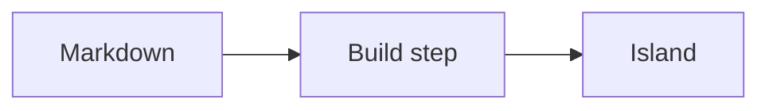

# Editorial Charter & Authoring Guide — Smart Ebooks

> How to write smart-ebook content consistently and how to embed interactivity with directives.
> Follow this for every chapter.
>
> **This file is also the constraint file for an authoring agent.** It is committed, and kept in step
> with `island-contract.json`, precisely so that a human and an agent are held to the same rules.
> If the two ever disagree, the contract is what the linter enforces — fix the charter.
>
> Last updated: 2026-09-26

---

## 1. Principles

- **Prose first, interactivity second.** A chapter must read well as plain Markdown even if every
  interactive island failed to load. Directives are *progressive enhancement*.
- **One vocabulary.** Use only the directives defined in §4. New interactivity means a new directive added
  here *and* a matching component in the app registry — never an ad-hoc block.
- **Local-only mindset.** Interactive elements must work with no network and no account. Never assume a
  server or fetch remote user data.
- **Accessible by default.** Everything usable by keyboard; every figure has a text alternative;
  color is never the only signal.

## 2. Tone & structure

- **Second person, direct** ("you"), pedagogical and precise; no hype.
- Reuse a **consistent chapter anatomy** where it fits the book (adapt from the certification books):
  intro → key concepts → how it works → practice (interactive) → recap.
- **Callouts** (blockquote, greppable) for emphasis:

  | Callout | Format |
  | --- | --- |
  | 📌 Key concept | `> 📌 **Key concept**: …` |
  | 🔍 How it works | `> 🔍 **How it works**: …` |
  | 💡 Tip | `> 💡 **Tip**: …` |
  | ⚠️ Pitfall | `> ⚠️ **Pitfall**: …` |
  | 📖 Definition | `> 📖 **Definition — Term**: …` |

  **The emoji is the whole mechanism.** The reader matches it and styles the blockquote by kind —
  each gets its own accent colour — so the five above are the five that render distinctly. A
  blockquote starting any other way stays an ordinary quotation, which is what a quotation should
  be. Keep the emoji as the first thing in the blockquote: it is greppable, it reads correctly as
  plain Markdown, and it is the only marker that survives an export where no stylesheet runs.

### Grouping chapters into parts

A long book reads as *Part I → chapters → Part II → …*, and the sidebar can show that. Declare the
parts once, then point chapters at them by `id`:

```json
"parts": [
  { "id": "foundations", "title": "Part I — Foundations" },
  { "id": "annexes", "title": "Annexes" }
],
"chapters": [
  { "file": "00-preface.md", "order": 0 },
  { "file": "01-tokens.md", "order": 1, "part": "foundations" },
  { "file": "90-glossary.md", "order": 90, "part": "annexes" }
]
```

- **`part` is optional.** A chapter without one sits at the top level — which is how a preface or a
  standalone appendix stays outside the grouping, wherever it falls in the order.
- **A part appears where its first chapter appears**, not where it sits in `parts`. Reading order is
  the one you can see in the book, so it wins.
- **Ids, not labels.** Writing the title on each chapter would mean one typo silently splits a part
  in two with nothing able to notice. An id that no `parts` entry declares is `part-unknown`; a part
  no chapter claims is `part-empty` (a warning — it simply never appears).
- **Grouping is presentation only.** Chapters remain one flat sequence, so next/previous, search and
  your reader's saved position all cross a part boundary without noticing it. Do not use parts to
  imply that chapters are optional or out of order.

## 3. Directive syntax (how interactivity is declared)

Interactivity uses [`remark-directive`](https://github.com/remarkjs/remark-directive) in two forms:

- **Container** (has a body of nested Markdown): three colons open and close.

  ````markdown
  :::name{key="value" key2="value2"}
  … nested Markdown / options …
  :::
  ````

- **Leaf** (a single line, no body): two colons.

  ```markdown
  ::name{key="value"}
  ```

Which form a directive takes is fixed per directive, not a choice — see §4.

**Rules:**

- `name` must be one of the registered directives in §4. Anything else **fails the build**
  (`directive-unknown`), it does not degrade to a placeholder.
- Names are **kebab-case** (`matching-pairs`, `chess-board`). The old concatenated spellings still
  render but the linter warns (`directive-alias`) — do not write new content with them.
- Attributes go in `{…}` as `key="value"` pairs, and are **validated against a declared schema**: an
  unknown value falls back to its default at runtime and is an error at lint time
  (`attribute-invalid`). A few attributes are **context-bound** — read only inside, or only outside,
  a particular container — and writing one in the wrong place is `attribute-ignored`. The rule exists
  because such an attribute is otherwise accepted, spelled correctly, and read by nobody.
- `id` is **required on any stateful directive** (quiz, flashcard, checkpoint, games) so its
  progress can be persisted deterministically. Omitting one is an error (`id-missing`) and
  duplicates are an error (`id-duplicate`). Both matter for the same reason: without an id every
  quiz in the book writes to the same key, which is exactly what two quizzes sharing an id do.
  The one exception is an island whose state belongs to a container it sits in — a `::chess-board`
  inside a `:::chess-game` needs no id, because the game holds one position for every board in it.
- `id` values are **stable and unique within the book** (kebab-case, prefixed by chapter, e.g.
  `ch1-tokens-quiz`). Changing an `id` resets that element's saved state.
- The **body** of a directive is normal Markdown, so the block still reads acceptably without the
  runtime.

## 4. Interactive directive taxonomy

> Legend: **State** = what the local persistence layer stores. **Pack** marks directives that are not
> built in: the book must declare the pack in `smartbook.json` before it may use them.
>
> This list must match [`island-contract.json`](island-contract.json), which is what the linter reads.

### `:::quiz` — Multiple-choice knowledge check (container)

Task-list syntax marks the answer(s); a blockquote after a question is its explanation.

````markdown
:::quiz{id="ch1-tokens-quiz"}
### What does a token represent?

- [ ] A full sentence
- [x] A chunk of text (sub-word)
- [ ] A single character

> Explanation: LLMs operate on tokens, typically sub-word units.
:::
````

- Multiple `###` questions allowed in one quiz block.
- `[x]` = correct option(s); more than one `[x]` = multi-select. The island switches from radios to
  checkboxes on its own, and marks the answer right only when the reader's set matches exactly — no
  partial credit, which is how "choose two" is marked in practice.
- Attribute: `shuffle` (`none` | `questions` | `options` | `both`, default `none`). Re-running a quiz
  in a fixed arrangement trains recall of *position* rather than of the material, so a revision set
  is usually worth shuffling. It is **off by default** because order is sometimes load-bearing:
  a set that builds question by question, or an option that says *"both of the above"*, must not
  move. An arrangement is dealt per attempt and kept until the reader retries, so reloading the page
  does not deal a new hand; answers are recorded against the question as written, never against a
  position on screen.
- **Do not number the options.** Writing `- [ ] A. …` puts the letter in the option's *text*, where
  it survives shuffling and starts lying. The same goes for an explanation that argues by letter
  (*"A is wrong…"*) — name the option instead, and it stays true in any order.
- **State:** best score, attempts, last answers, completed flag.

### `:::flashcard` — Flip card / spaced repetition (container)

````markdown
:::flashcard{id="ch1-token-def"}
**Front:** What is a token?

**Back:** A sub-word unit of text an LLM processes.
:::
````

- Group cards by placing several `:::flashcard` blocks together.
- **State:** review progress, stored locally.

### `::checkpoint` — Mark-as-complete / progress marker (leaf)

```markdown
::checkpoint{id="ch1-done" label="I finished the fundamentals"}
```

- Attributes: `label` (string).
- Renders a checkbox the reader ticks; feeds the global progress dashboard.
- **State:** complete flag.

### `:::matching-pairs` — Match-the-pairs exercise (container)

````markdown
:::matching-pairs{id="ch3-matching"}
```json
{
  "pairs": [["token", "sub-word unit"], ["context window", "token budget"]]
}
```
:::
````

- The body is a JSON object with a `pairs` array of `[left, right]` tuples.
- **State:** best (fewest) number of moves.

### `:::mermaid` — Diagram (container) — **pack: `mermaid`**

````markdown
:::mermaid{title="How a directive becomes an island"}

```mermaid
flowchart LR
    MD["Markdown"] --> B["Build step"] --> I["Island"]
```
:::
````

- Attributes: `theme` (`auto` | `default` | `neutral` | `dark` | `forest` | `base`, default `auto`,
  which follows the reader's light/dark setting), `title` (used as the caption).
- The body is a fenced ` ```mermaid ` block — a picture that stays **text** in the source, so it is
  reviewable in a diff and translatable like prose.
- No `id`: the island stores nothing.
- **State:** none.

### Chess directives — **pack: `chess`**

````markdown
:::chess-board{id="ch1-game" pieces="unicode" analysis="on" moves="on"}
```pgn
{Scholar's Mate.} 1. e4 e5 2. Bc4 {Eyeing f7. [%cal Gc4f7]} Nc6 3. Qh5?! Nf6?? 4. Qxf7#
```
:::

:::chess-board{id="ch1-immortal" moves="scroll" pgn="assets/immortal.pgn"}
:::

::chess-diagram{fen="6k1/5ppp/8/8/8/8/5PPP/R5K1 w - - 0 1" caption="White to move."}

:::chess-puzzle{id="ch1-puzzle" fen="6k1/5ppp/8/8/8/8/5PPP/R5K1 w - - 0 1" solution="Ra8#"}
Ra8# — a back-rank mate.
:::

::chess-analysis{id="ch1-eval" fen="…" eval="+0.20" best="a6"}
````

- `chess-board` (container, body is a fenced ` ```pgn ` block): `theme`, `pieces`, `orientation`,
  `analysis`, `shapes`, `moves`, `pgn`.
  - `moves` is `off` (default) | `on` | `scroll` — show the whole game score, every move clickable.
    `scroll` caps its height, which a long game needs.
  - `pgn` names a **packaged** `.pgn` file and wins over the body. Declare it in `assets` like any
    other asset. Note the cost: a board whose game lives in a file cannot produce a full static
    form, so prefer the body unless the game is long or came from a real PGN.
  - The PGN may contain **variations** — `1. e4 e5 (1... d5 2. exd5) 2. Nf3` — and they are shown,
    indented, under the move they replace.
- `chess-diagram` (leaf **or** container): `fen` (**required**), `caption`, `orientation`, `shapes`,
  plus `theme` / `pieces`. A position and nothing else: no controls, no engine, no saved state. The
  caption may be the container body instead of the attribute, which reads better and keeps the
  directive line short.
- `chess-puzzle` (container, body is the solution **prose**): `theme`, `pieces`, `orientation`,
  `fen` (**required**), `solution`, `hint`.
  - With `solution` — SAN, one move or a whole line, e.g. `solution="Rb8 Rxb8 Rxb8#"` — the reader
    **plays** the move on the board and the island marks it, playing the opponent's replies. Without
    one it stays "reveal the answer and tick the box yourself".
  - Move numbers in a solution are tolerated and ignored. Write the moves the way you would in prose.
- `chess-analysis` (leaf): `fen` (**required**), `depth`, `eval`, `best` — evaluation of one position,
  with no board. `eval` and `best` state *your* assessment; they are shown before any engine runs, and
  they are the only part that survives an export. The engine never starts until the reader clicks.
- `theme` is one of `brown` | `blue` | `green` | `grey`; `pieces` is `cburnett` | `unicode`;
  `orientation` is `white` | `black` | `auto` (the default — the side to move). A book can set its own
  defaults in `smartbook.json`.
- Comments may carry board drawings in PGN's own syntax: `[%cal Gd1h5]` for an arrow, `[%csl Rf7]`
  for a highlighted square, colours `G`/`R`/`Y`/`B`. They are drawn on the board and removed from the
  text the reader sees. `chess-diagram` takes the same tokens in its `shapes` attribute.
- **State:** current position per board; solved flag per puzzle.

#### `:::chess-game` — a game you lay out yourself

````markdown
:::chess-game{id="ch4-scholars" pieces="unicode" analysis}

```pgn
1. e4 e5 2. Bc4 Nc6 3. Qh5 Nf6?? 4. Qxf7# {Scholar's mate.}
```

White opens with :move[1. e4], and Black mirrors with :move[e5].

Now :move[2. Bc4] eyes **f7**, and :move[3. Qh5] threatens mate in one.

::chess-moves

After :move[4. Qxf7#] it is over.

::chess-board{at="4. Qxf7#"}

:::
````

`chess-board` above is a whole game in a box: board on top, controls under it, commentary elsewhere.
`chess-game` is the same game **laid out like a printed chess book** — a paragraph, a diagram at the
critical moment, more prose, the score where you want it. Use it whenever the commentary matters as
much as the moves; use `chess-board` when you just want a game on the page.

**The board is chrome, and the game draws it for you.** A `chess-game` is two parts: one board that
holds still, and your prose in a pane beneath it that scrolls. So the commentary can run for pages
and the board is still there at the end of it — which is the whole reason to write a game this way,
and the thing a board sitting in the middle of the text could never do. You do not place the live
board, and there is no attribute to turn it off.

What you *do* place is everything a printed chess book places: **diagrams** at the interesting
moments, the score, and the prose.

**What you must write, and what you may leave out.** Only two things are required: the
`:::chess-game` itself with an `id`, and **a game for it to hold** — either a fenced ` ```pgn ` block
in the body or a `pgn="assets/…"` attribute. Everything inside is optional: a game that is nothing
but prose and `:move` marks is valid.

**The PGN is the only source of moves.** `:move[2. Bc4]` does not *make* a move — it names one that
must already be in the game, and renders as the words you typed if it is not. Without a PGN there is
no game: every mark becomes plain text and every board and score inside says so.

- `chess-game` (container): `pgn`, `shapes`, `analysis`, plus `theme` / `pieces` / `orientation`. It
  owns the game, the position and the board. The fenced ` ```pgn ` block is configuration, not
  content: it is consumed, not printed.
  - `analysis` offers Stockfish under the game's board, bound to wherever the reader is. It belongs
    to the game rather than to a board because a game has one board.
- `::chess-board{at="…"}` **inside** a game is a **diagram**: a position pinned where you put it,
  with no controls, which is what a printed diagram is. Its value is a move written as you would
  write it in prose: `at="4. Qxf7#"`. It takes no PGN and no `id` — the container holds the game.
  - A `::chess-board` with no `at` inside a game still works, and still follows the reader, but you
    almost certainly do not want one: the game already gives you a board, and a second live board
    shows the same position twice.
  - `moves`, `pgn` and `at` are **context-bound** (`attribute-ignored`): the first two mean nothing
    inside a game, because the container owns the score and the game; `at` means nothing outside one,
    because there is no published position to pin to. Inside a game, the score is `::chess-moves`.
- **A diagram inside a game is also a way in.** Tap either kind — `::chess-board{at="…"}` or
  `::chess-diagram{fen="…"}` — and the game's board shows that position. You write nothing to get
  this: a diagram names a position, and if this game reaches it the diagram becomes a control. A
  diagram of a position from somewhere else stays a picture with nothing to tap, which is correct
  and not an error — a book may print any position it likes.
  - The clocks in a FEN (the last two numbers) are ignored when matching, so you can copy a position
    without counting halfmoves. Everything else — the pieces, whose turn it is, castling rights and
    the en-passant square — has to agree, because those are the position.
- `::chess-moves` (leaf): `scroll` (default `true`) — the game score, placed where you want it.
- `:move[…]` (**inline**) marks a move in a sentence and jumps every board on the page to it.
  - The label is a move, matched the way a reader reads it: `2. Bc4`, `2.Bc4` and `Bc4` all work, and
    annotation glyphs are ignored. An unqualified move means the main line; write the number to
    reach one inside a variation (`:move[3... g6]`).
  - A label the game does not contain renders as **the plain words you wrote** — no dead button. The
    content linter cannot catch this for you, so check your marks against the score.
- **Static form:** your own body. Strip the interactivity and a `chess-game` is the prose, the moves
  named in it, and whatever the child islands emit — which is what a chess book is.
- **State:** the current position, once for the whole game, under the same key a `chess-board` uses.
  Rewriting a `chess-board` chapter as a `chess-game` keeps the reader's place.

### `term` — a mark inside a sentence

```markdown
A :term[palimpsest]{definition="A manuscript page scraped clean and written on again."} page.
```

- Written in the inline form `:name[label]{…}`, which is a different thing from `::` and `:::`:
  writing an inline directive as a block, or a block one inline, is a lint error. The others are
  `:move` (chess), `:note` (music), and `:choice` / `:ending` / `:death` / `:restart` (gamebook).
- The bracketed label is the word as it appears in the sentence. It stays in the prose: no box, no
  block, no change to the line.
- Attribute: `definition`. Without one the word simply renders as itself, because a term with nothing
  to explain is not worth interrupting a sentence for.
- No `id`: the island stores nothing.
- **Static form:** the label. An inline island needs no fallback — stripped of interactivity it is
  the word the author wrote, which is how a printed glossary term reads.
- **State:** none.

### Gamebook directives — **pack: `gamebook`**

A book the reader walks through by choosing. The reader is delivered **one section at a time**, which
is what makes withholding the rest possible at all — a section that was never rendered cannot be
scrolled into or found with Ctrl+F.

That is a property of the *book*, not of these directives. The descriptor must declare `unitDepth`,
and every heading at that depth is a section:

```json
{ "unitDepth": 2, "islands": { "packs": { "gamebook": {} } } }
```

````markdown
## 1

The cellar door stands open at the bottom of the garden.

If you go down at once, :choice{to="2"}.

If you fetch the lantern from the shed first, :choice[take the lantern]{to="3"}.

## 6

You sit. After a while you stop minding.

:death[*Your story ends here.*]{to="4"}

## 9

You wake to find the cellar door bolted from the inside.

:ending[*Your story ends here.*] :restart{to="1"}

::journeys
````

- `choice` (inline): `to` (**required**) — a section id in this book, never a URL. The bracketed label
  is optional; without one the link is the printed book's own line, `turn to 45`.
- `ending` (inline): no attributes. The body is your own closing line.
- `death` (inline): `to` (**required**) — where the reader picks the story up again.
- `restart` (inline): `to` (**required**) — where a new attempt begins, usually but not necessarily
  section one. The previous attempt is kept as a closed journey, not destroyed.
- `journeys` (**leaf**, `::journeys`): the routes this reader has taken, and the interior gaps
  between them. No attributes, and no static form — a printed page has no reader.
- **State:** one playthrough per book — the route taken, the attempts closed before it.

Four rules that the syntax does not show, each of which the linter enforces:

**Sections are numbered across the whole book, not per file.** Write `## 1` through `## 300` over as
many files as you like, in one continuous sequence. Which file holds section 217 is your filing
decision and must never appear in the prose, in a directive, or in a link — `:choice{to="217"}`
resolves wherever 217 lives, and moving it to another file later breaks nothing. Two files opening
the same number is a `duplicate-id` error, because the reader would silently get whichever came
first.

**An ending is a claim you make, not something inferred.** A section with no choices is not assumed
to be an ending, and neither is one carrying a `:restart` — a restart is an affordance you may offer
anywhere, and a book that puts its restarts elsewhere would otherwise read as full of dead ends.
Mark a terminal section `:ending` or `:death`, or it is a `dead-end` error.

**A death's respawn must dominate the death.** Every route that reaches the death has to have passed
through the section it returns to, or you are sending the reader somewhere they have never been. This
shapes how an act is laid out, so it is worth thinking about while writing rather than at lint time
(`respawn-unreachable`).

**These are inline directives: one colon.** `:choice{to="2"}` sits inside your sentence.
Writing `::choice` mid-sentence is literal text, not a directive. Only `::journeys` is a leaf and
must begin its own line.

The pack speaks the book's declared `language`: a book in French says « rendez-vous au 45 », not
"turn to 45", and so do the notes on the roads already taken.

What `npm run lint:content` checks, beyond the usual: `choice-target` (a choice to a section that
does not exist), `dead-end`, `duplicate-id`, `respawn-missing`, `respawn-unreachable`, `start-missing`,
and `unreachable` as a **warning** — half-written acts are legitimately unreachable for days.

### Music directives — **pack: `music`**

Two containers and one inline mark. The body of either container is a fenced ` ```abc ` block —
[ABC notation](https://abcnotation.com), which is to a tune what PGN is to a game: compact, text,
reviewable in a diff, and written by a person rather than exported by a program.

````markdown
:::music-figure{caption="A note on the bottom line, then one in the space above it"}

```abc
X:1
K:C
E2 F2|
```

:::

:::music-piece{caption="Ode to Joy, first phrase"}

```abc
X:1
L:1/4
K:C
E E F G|G F E D|
```

The phrase starts on :note[E] and climbs to :note[G] before turning back.

:::
````

- `music-figure` (container): `caption`, `width`, `src`. A printed example — it draws and does
  nothing else. This is the one a theory book uses most: a chapter on intervals is a hundred
  two-bar examples, and almost none of them should play or remember anything.
- `music-piece` (container): `caption`, `width`, `src`, `play`, `names`. A score the prose walks
  through, with the notes named in that prose able to point at it. The score is chrome: the
  container draws it, you do not place it. `play` defaults to on; the name of whichever note is
  sounding appears beside the caption.
- `:note[…]` (**inline**): `nth`. A note named inside a sentence, which jumps the score to it.
- **No `id` on any of them** — the pack stores nothing for the reader.

**A tune may come from a file:** `src="assets/tune.abc"`, declared in `assets` like any other. Only
a **packaged** file is read, never a URL, because an `.abc` is read as text and engraved by the
book's own code rather than handed to the browser to fetch. Only `.abc` is read; `.mxl` is a ZIP and
is refused by name. A file and an inline body together is an error, because the file wins and the
body would never be drawn.

**Naming a note.** The label is the note as your sentence says it — letters or solfège, both
understood with nothing to declare, since they cannot be confused: `C`, `Do`, `Ut`, `Ré`, `Sol`.
Accents and case are ignored. An accidental may be a sign, ASCII or a word: `C#`, `C♯`, `Do dièse`,
`Bb`, `Si♭`, `F natural`. A label with no accidental matches whatever is in force, so in G major
`:note[F]` finds the F sharp the key signature put there. `nth` picks between repeats, counting from
one: `:note[G]{nth=3}`.

- `names` (`letters` | `solfege`) sets what a **piece prints** when it shows a name, overriding the
  book's own `noteNames`. It changes nothing about what labels are accepted. It exists for the one
  case that asked for it — a chapter teaching two systems side by side.
- German naming (`H` for B natural, `B` for B flat) is **not** accepted in a label. It is the one
  system that collides with another, so admitting it would make `:note[B]` ambiguous.

**A piece must be playable, and a figure need not be.** A `music-piece` sounds its tune one note at
a time, so a chord, a tied note or a second voice inside one is a lint error
(`music-unplayable`): the sound would be wrong and the mark could point at the wrong notehead.
A `music-figure` draws all three correctly and is left alone — if you want to *show* a chord, show it
in a figure.

A **tuplet is allowed in a piece**. It was refused until its notes were given the time they occupy
rather than the time they are written in; a triplet used to run half a beat long and leave every
note after it late for the rest of the tune. That is fixed, and a tuplet fits the model — still one
note at a time, each for as long as it actually sounds.

- **Static form:** a figure emits its caption and its ABC source, the way `:::mermaid` emits its
  diagram source. A piece emits your prose, which is what a book about a piece of music mostly is.
- **State:** none.

**Declare `M:` and `L:` on every tune.** ABC has defaults and applies them silently, so a tune that
omits them draws something — usually the right thing, by luck — and nothing checks it. With a meter
declared, every bar is measured against it (`music-bar-length`); without one, the bars are not
checked at all and you get a warning saying so (`music-meter-undeclared`). A short first bar is
accepted when the last bar completes it exactly, which is how an anacrusis is written.

For a figure that shows where notes sit rather than measured music, write `M:none`. It is the way to
say *this is a picture, not a bar* — abcjs then draws no time signature, and the bar check stands
down rather than measuring a figure against a meter it never claimed.

What `npm run lint:content` checks, beyond the usual: `music-no-tune`, `music-silent-tune` (it
parses, but there is no note in it), `music-source-format`, `music-two-tunes`, `music-unplayable`,
`music-bar-length` (a bar holding more or less than its meter), `music-meter-undeclared` (a warning:
ABC's defaults are in force and the bars go unchecked), `music-note-unresolved` (a label naming no
note in the tune) and `music-note-loose` (a `:note` outside any piece, which renders as plain text).

## 5. Authoring checklist

- [ ] Chapter reads correctly as plain Markdown (directives degrade gracefully).
- [ ] Every stateful directive has a unique, stable `id`.
- [ ] Only directives from §4 are used, in their canonical kebab-case spelling.
- [ ] Any pack a directive belongs to is declared in `smartbook.json`.
- [ ] Every `assets/…` reference exists in the book folder.
- [ ] `visibility` is set on the book — `public` to publish, `private` to keep it off the site.
- [ ] Figures and diagrams have a caption or are explained by the surrounding prose.
- [ ] Correct answers and explanations are provided for quizzes.
- [ ] No directive assumes network access, a server, or a user account.
- [ ] `npm run lint:content` passes.

## 6. Adding a new directive (governance)

1. Propose the directive name, attributes, body format, and stored state **here** (§4).
2. Implement the matching React component and register it (`directive → component`).
3. Mirror it in `island-contract.json`, which the linter reads.
4. Add unit tests (parsing + component) and, if user-facing, an e2e path.
5. **Demonstrate it in a bundled book** — `island-coverage.test.mjs` fails otherwise.

Content and components must always agree: **the charter is the contract.**
